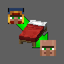

## Resettleable Traders
[![Minecraft](https://img.shields.io/badge/1.20.1-white?style=for-the-badge&logo=data%3Aimage%2Fpng%3Bbase64%2CiVBORw0KGgoAAAANSUhEUgAAABAAAAAQCAYAAAAf8%2F9hAAAAAXNSR0IArs4c6QAAAARnQU1BAACxjwv8YQUAAAAJcEhZcwAADsMAAA7DAcdvqGQAAAAZdEVYdFNvZnR3YXJlAHBhaW50Lm5ldCA0LjAuMjCGJ1kDAAACoElEQVQ4T22SeU8aURTF%2FULGtNRWWVQY9lXABWldIDPIMgVbNgEVtaa0damiqGBdipXaJcY2ofEf4ycbTt97pVAabzK5b27u%2BZ377kwXgK77QthRy7OfXbeJM%2BttqKSXN8sdwbT%2FA0L7elmsYqrPHZmROLPh5YkV4oEBwaKuHj%2ByyJptLDoAhbq3O1V1XCVObY3FL24mfn5oRPrcwSCRfQOyNWcjVjZdCbtcdwcgXrXUspdOKbDN%2FXE9tiBJMhXHT60gUIT2dMhcDLMc3NVKQklz0QIkf5qlyEcO6Qs7yPhMJB4amDMFimQSmqNlE8SKAZFzDfxHfVILIIZ10sJ3OwIbcqSuiOjchkzNCboHev9o2YhgiUP8mxnLN24I6%2F3ghYdtQG5iUMpFBuCP9iKwLsfiLyeCp2rMnZgwX3NArGoxW1Ridl%2BBzLEVKa8KSxOqNmDdz0kFnxaLHhWEgAyZigWhHXL%2BpEDy2ozsDxv8vAzTnh7w5kcghqCaFmCT10of4iPIT2mRdPUh4HoCcVwBH%2F8Ac2kzUkEV5r3EfVSOvbAJa5NDyI0r2oDtWb1EClh%2BOoC3Pg7v%2FBw7p939yI4rsRW2Y3lKh01eh7WpIRyKZqzyjjYgPdIvlaMWRqYuG7wWryYHsRM0sFolZiPvQ3jheIwSmSBPdkByG%2FB6Wi3RYiVmRX7GiAPiUCRisii8D%2BjZNKvPBrHCW1GY0bAz6WkDCtOaSyKQFsi4K5NqNiZtehN2Y5uAShETqolhBqJXpfdPuPsuWwAaRdHSkxdc11mPqkGnyY4pyKbpl1GyJ0Pel7yqBoFcF3zqno5f%2Bd8ohYy9Sx7lzQpxo1eirluCDgt%2B%2B00p6uxttrG4F%2FA39sJGZWZMfrcp6O6%2B5kaVzXJHAOj6DeSs8qw5o8oxAAAAAElFTkSuQmCC&labelColor=black)](https://minecraft.net/)
[](https://www.curseforge.com/minecraft/mc-mods/resettleable-traders-forge-fabric)
[](https://modrinth.com/mod/resettleable-traders)
[](https://github.com/donmor/resettleable_traders/releases/latest)
[![Forge](https://img.shields.io/badge/Forge-orange?style=for-the-badge&logo=data%3Aimage%2Fpng%3Bbase64%2CiVBORw0KGgoAAAANSUhEUgAAABAAAAAQCAMAAAAoLQ9TAAAABGdBTUEAALGPC%2FxhBQAAACBjSFJNAAB6JgAAgIQAAPoAAACA6AAAdTAAAOpgAAA6mAAAF3CculE8AAAA7VBMVEUdLUEcLEAbKz8aKj4sO04zQlQzQVM0QlQ2RFY2RVYlNEgqOUx0fouPl6GNlZ%2BFjpl%2FiJO7wMbe4ePU19vLz9TEyM6dpK2Gjpk9S1weLkJZZXPS1dn%2F%2F%2F%2F4%2Bfni5Ofv8fL%2B%2Fv7o6euDjJc1Q1UfL0MeLUEaKj%2BWnafX2t7j5ef19fb39%2FhyfIgbLEAbK0AvPlA3RVd3gY35%2BfrX2t0rOk0nNkp8hZH4%2BPnp6%2B1kb30oN0q3vMPg4uX3%2BPjl5%2BnY296zub8%2BTF3JzdKTm6ReaXhTX25daXeLk57Hy9A8SlsgMEMrOkwkM0cjMkYgL0P3AqTmAAAAAWJLR0QcnARBBwAAAAd0SU1FB%2BAJFRIdHqqGUp8AAACMSURBVBjTY2AgFzBCAYjNxMzMzMjCysbKys7BycXAwM3Dy8cvICgkLCIqKCYuwcQgKSUtIysnLyOjoKikrKIK1KLGqa6hqSUjo62jqwcxUI9B38DQSMbYhAluB5OpmbmMhaUVI8xOFmsbOVs7ewcTqAiTo5Ozi6ubu4cnTJOXtw%2FQMb7cfgiHIpEEAQAlIg2L5ZmkuQAAACV0RVh0ZGF0ZTpjcmVhdGUAMjAxNi0wOS0yMVQxODoyOTozMCswMjowMOts9rwAAAAldEVYdGRhdGU6bW9kaWZ5ADIwMTYtMDktMjFUMTg6Mjk6MzArMDI6MDCaMU4AAAAAGXRFWHRTb2Z0d2FyZQBBZG9iZSBJbWFnZVJlYWR5ccllPAAAAFd6VFh0UmF3IHByb2ZpbGUgdHlwZSBpcHRjAAB4nOPyDAhxVigoyk%2FLzEnlUgADIwsuYwsTIxNLkxQDEyBEgDTDZAMjs1Qgy9jUyMTMxBzEB8uASKBKLgDqFxF08kI1lQAAAABJRU5ErkJggg%3D%3D&labelColor=black)](https://minecraftforge.net/)
[](https://fabricmc.net/)
[](https://github.com/architectury/architectury-api)



This tiny Minecraft mod makes it posible to convert wandering traders to unemployed villagers, by clicking with a bed in hand. You need to buy everything before converting a trader.

#### Configuration
`config/resettleable_traders-common.toml`
```
#Convert traders even if they're still tradeable
DiscardOffers = false
```

#### Dependencies
[Architectury API](https://github.com/architectury/architectury-api) is required to use this mod. Fabric version requires [Forge Config API Port](https://github.com/Fuzss/forgeconfigapiport) in addition.